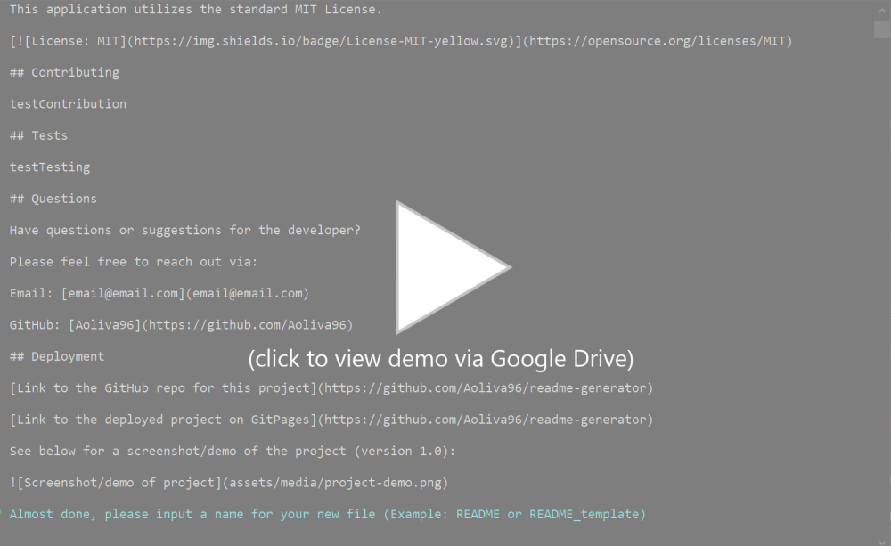

# Test Title 

  ## Project Description
  
  Test description
  
  ## Table of Contents
  
  - [Installation](#installation)
  - [Usage](#usage)
  - [License](#license)
  - [Contributing](#contributing)
  - [Tests](#tests)
  - [Questions](#questions)
  - [Deployment](#deployment)
  
  ## Installation
  
  Test installation instructions
  
  ## Usage
  
  Test usage information
  
  ## License
  
  This application utilizes the standard MIT License.

  

  ## Contributing

  Test contribution guidelines

  ## Tests

  Test testing instructions

  ## Questions

  Have questions or suggestions for the developer? 

  Please feel free to reach out via:

  Email: [email@email.com](email@email.com)

  GitHub: [Aoliva96](https://github.com/Aoliva96)
  
  ## Deployment
  
  [Link to the GitHub repo for this project](https://github.com/Aoliva96/readme-generator)
  
  [Link to the deployed project on GitPages](https://github.com/Aoliva96/readme-generator)

  See below for a screenshot/demo of the project (version 1.0):
  
  
  